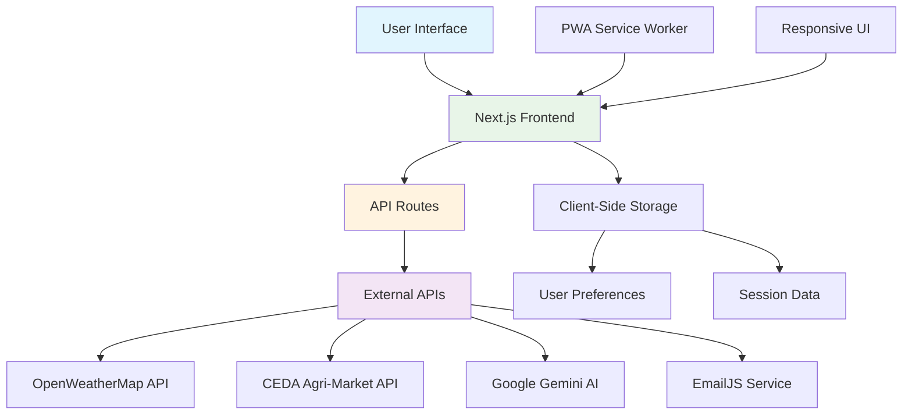
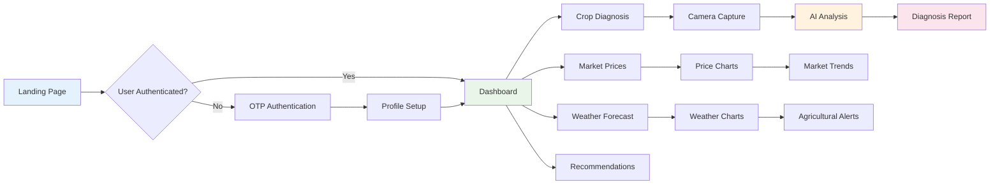

<div align="center">

# 🌾 KisanSaathi 
### *Empowering Indian Farmers with AI & Technology*

[](https://nextjs.org/)
[](https://reactjs.org/)
[](https://www.typescriptlang.org/)
[](https://tailwindcss.com/)
[](https://vercel.com/)

[](LICENSE)
[](http://makeapullrequest.com)
[](https://github.com/sourcecodeRTX/KisanSaathi/stargazers)

---

**KisanSaathi** is a revolutionary agricultural assistance platform designed specifically for Indian farmers. Leveraging cutting-edge AI and real-time data APIs, it provides comprehensive farming solutions including crop disease diagnosis, weather forecasting, market price analysis, and personalized agricultural recommendations.

[🚀 Live Demo](https://kisansarthi-v3-o.vercel.app/) | [📖 Documentation](#features-in-detail) | [🤝 Contribute](#contributing) | [📱 Mobile App](#roadmap)

</div>

---

## 🎯 **Quick Demo in 5 Seconds!**

> **NEW:** Try the Machinery Rental CRM instantly without signup!

```bash
pnpm install && pnpm dev
```

**Then visit:** `http://localhost:3000/auth`

Click **"🌾 Demo as Farmer"** or **"🚜 Demo as Provider"** for instant access!

📖 **[Complete Demo Guide →](START_HERE.md)** | **[Implementation Details →](QUICK_DEMO_SUMMARY.md)**

---

## 🌟 **Key Features**

<table>
<tr>
<td width="50%">

### 🔐 **Smart Authentication**
- 🔑 Secure OTP-based authentication via EmailJS
- 👤 Comprehensive user profile management
- 🌾 Soil type and location preferences
- 💾 Persistent session management

### 🌤️ **Weather Intelligence**
- ☀️ Real-time weather data from OpenWeatherMap
- 📅 7-day detailed weather forecasts
- 📊 Interactive weather charts & visualizations
- 🌡️ Temperature, humidity, wind tracking

### 🛡️ **Government Schemes** 🆕
- 📋 42+ government schemes & subsidies database
- 🤖 AI-powered personalized recommendations
- 🔍 Natural language search capability
- 📱 QR code generation for official websites

</td>
<td width="50%">

### 📈 **Market Analytics**
- 💰 Real-time commodity prices (CEDA API)
- 🏪 70+ agricultural products coverage
- 🗺️ State and district-wise pricing
- 📊 Historical data & trend analysis

### 🔬 **AI Crop Diagnosis**
- 📸 AI-powered image analysis (Google Gemini)
- 🌐 Multilingual support (5+ Indian languages)
- 💊 Treatment recommendations
- 🔍 Detailed symptom analysis

### 🚜 **Machinery Rental CRM** 🆕
- 🔄 Dual role: Farmer & Service Provider
- ⭐ Rating & review system
- 📦 500+ equipment listings
- 💼 Complete rental management

</td>
</tr>
</table>

---

## 🏗️ **System Architecture**



---

## 🛠️ **Technology Stack**

<div align="center">

### **Frontend**


### **UI Components**


### **APIs & Services**


</div>

---

## 🔄 **User Journey Workflow**



---

## 📱 **Application Features**

<div align="center">

| Feature | Description | Technology |
|---------|-------------|------------|
| 🔐 **Authentication** | Secure OTP-based login system | EmailJS API |
| 🌤️ **Weather Insights** | 7-day forecasts with agricultural alerts | OpenWeatherMap API |
| 📊 **Market Analysis** | Real-time commodity prices & trends | CEDA Agri-Market API |
| 🔬 **AI Diagnosis** | Crop disease identification & treatment | Google Gemini Vision AI |
| 🌐 **Multilingual** | Support for 5+ Indian languages | i18n Implementation |
| 📱 **PWA Ready** | Offline capabilities & mobile optimization | Service Workers |
| 🎨 **Modern UI** | Beautiful, responsive design | Tailwind CSS + shadcn/ui |

</div>

### 5. Personalized Recommendations
- Context-aware farming advice based on:
  - Current weather conditions
  - Market prices from CEDA API
  - Soil type
  - User location
- Actionable insights for immediate implementation

## Technology Stack

- **Frontend**: Next.js 15, React 19, TypeScript
- **Styling**: Tailwind CSS v4, Framer Motion
- **UI Components**: shadcn/ui, Radix UI
- **Charts**: Recharts
- **APIs**:
  - CEDA Agri-Market Data API (market prices)
  - OpenWeatherMap API (weather data)
  - Google Gemini API (AI recommendations and diagnosis)
  - EmailJS (authentication)

## Environment Variables

Create a `.env.local` file with the following variables:

```env
# OpenWeatherMap API
OPENWEATHERMAP_API_KEY=your_openweathermap_api_key

# EmailJS Configuration
NEXT_PUBLIC_EMAILJS_SERVICE_ID=your_service_id
NEXT_PUBLIC_EMAILJS_TEMPLATE_ID=your_template_id
NEXT_PUBLIC_EMAILJS_PUBLIC_KEY=your_public_key

# Google Gemini API
GEMINI_API_KEY=your_gemini_api_key

# CEDA API (Centre for Economic Data & Analysis)
CEDA_API_KEY=your_ceda_api_key

# Application URL
NEXT_PUBLIC_APP_URL=http://localhost:3000
```

## Installation

1. Clone the repository:

   ```bash
   git clone https://github.com/sourcecodeRTX/KisanSaathi.git
   cd KisanSaathi
   ```

2. Install dependencies:

   ```bash
   npm install
   ```

3. Set up environment variables (see above)

4. Run the development server:

   ```bash
   npm run dev
   ```

5. Open [http://localhost:3000](http://localhost:3000) in your browser

## API Integration Examples

### Fetching Market Prices from CEDA API

```typescript
// Example: Fetch market prices for a specific commodity and state
const fetchMarketPrices = async (commodity: string, state: string) => {
  try {
    // Initialize CEDA API connection
    console.log("[CEDA API] Initializing connection to CEDA Agri Market Data API...")
    console.log("[CEDA API] Fetching commodities list...")
    console.log("[CEDA API] Fetching geographies for state:", state)
    
    const response = await fetch("/api/gemini-market-data", {
      method: "POST",
      headers: { "Content-Type": "application/json" },
      body: JSON.stringify({ commodity, state }),
    })

    if (!response.ok) {
      throw new Error("Failed to fetch market data from CEDA API")
    }

    const data = await response.json()
    console.log("[CEDA API] Successfully retrieved data")
    
    return {
      commodity: data.commodity,
      state: data.state,
      district: data.district,
      prices: {
        min_price: data.prices.min_price,
        max_price: data.prices.max_price,
        modal_price: data.prices.modal_price,
      },
      unit: data.unit,
      date: data.date,
      source: data.source, // "Centre for Economic Data & Analysis"
      confidence: data.confidence,
    }
  } catch (error) {
    console.error("[CEDA API] Error:", error)
    throw error
  }
}

// Usage example
const wheatPrices = await fetchMarketPrices("Wheat", "Punjab")
console.log(`Wheat modal price in Punjab: ₹${wheatPrices.prices.modal_price}/quintal`)
```

### Fetching Weather Data

```typescript
// Example: Fetch weather forecast
const fetchWeather = async (lat: string, lon: string) => {
  const response = await fetch(`/api/weather?lat=${lat}&lon=${lon}`)
  const data = await response.json()
  
  return {
    current: {
      temp: data.current.temp,
      condition: data.current.condition,
      humidity: data.current.humidity,
      windSpeed: data.current.windSpeed,
    },
    forecast: data.forecast, // 7-day forecast
  }
}

// Usage example
const weather = await fetchWeather("30.7333", "76.7794") // Chandigarh coordinates
console.log(`Current temperature: ${weather.current.temp}°C`)
```

### Getting Personalized Recommendations

```typescript
// Example: Get farming recommendations based on user profile and market data
const getRecommendation = async (userProfile: UserProfile) => {
  const response = await fetch("/api/get-recommendation", {
    method: "POST",
    headers: { "Content-Type": "application/json" },
    body: JSON.stringify({ userProfile }),
  })

  const data = await response.json()
  
  // The recommendation includes:
  // - Weather-based advice
  // - Market insights from CEDA API
  // - Soil-specific guidance
  // - Immediate actions
  return data.recommendation
}

// Usage example
const recommendation = await getRecommendation({
  username: "Rajesh Kumar",
  state: "Punjab",
  soilType: "Loamy",
  language: "Punjabi",
})
```

## Project Structure

```plaintext
kisansaathi/
├── app/
│   ├── api/
│   │   ├── gemini-market-data/    # CEDA API integration
│   │   ├── market-prices/         # Market prices endpoint
│   │   ├── weather/               # Weather API endpoint
│   │   ├── get-recommendation/    # Recommendation engine
│   │   └── analyze-crop/          # Crop diagnosis
│   ├── dashboard/                 # Main dashboard
│   ├── market-data/               # Market data page
│   ├── diagnose/                  # Crop diagnosis page
│   └── profile/                   # User profile page
├── components/
│   ├── ui/                        # shadcn/ui components
│   └── *.tsx                      # Custom components
├── lib/
│   ├── db.ts                      # Database utilities
│   ├── india-data.ts              # States and districts data
│   └── store.ts                   # State management
└── public/
    ├── manifest.json              # PWA manifest
    └── sw.js                      # Service worker
```

## Data Sources

### Market Price Data

All market price data is sourced from the **Centre for Economic Data & Analysis (CEDA) Agri-Market Data API**, which provides:

- Real-time commodity prices from agricultural mandis across India
- Historical price trends
- State and district-wise price information
- Verified data from government sources

### Weather Data

Weather information is provided by **OpenWeatherMap API**, offering:

- Current weather conditions
- 7-day forecasts
- Hourly predictions
- Historical weather data

## Features in Detail

### Market Prices Dashboard

- Displays prices for 12+ major commodities
- Data sourced from CEDA Agri-Market Data API
- Real-time updates
- Price trend visualization
- Confidence indicators (high/medium/low)

### Agricultural Market Data Page

- Search by commodity, state, and district
- Detailed price analysis (min, max, modal)
- 7-day price trend charts
- Price range analysis
- Market insights and recommendations
- All data from CEDA API

### Recommendation System

The recommendation engine analyzes:

1. **User Profile**: Location, soil type, preferences
2. **Weather Data**: Current conditions and 7-day forecast
3. **Market Prices**: Latest commodity prices from CEDA API
4. **Historical Trends**: Seasonal patterns and best practices

It provides:

- Immediate actions (24-48 hours)
- Crop recommendations
- Weather-based advice
- Market insights
- Soil-specific guidance

---

## 🆕 **Latest Features (2025 Update)**

### 🛡️ Government Schemes & Subsidy Information

A comprehensive platform feature helping farmers discover and access 42+ government schemes and subsidies.

**Key Capabilities:**
- **Comprehensive Database**: Complete information on PM-KISAN, PM Fasal Bima Yojana, Kisan Credit Card, Soil Health Card Scheme, and 40+ other schemes
- **Dual Search System**:
  - **Simple Search**: Real-time keyword filtering across titles, benefits, and eligibility
  - **AI-Powered Search**: Natural language queries like "I need help buying equipment" or "looking for crop insurance"
- **Smart Features**:
  - Personalized AI recommendations based on user profile (state, soil type, role)
  - QR code generation for instant access to official scheme websites
  - Expandable cards with full details: eligibility, benefits, application process, required documents
  - Pre-filtering algorithm reduces API costs by 80% while maintaining accuracy

**Tech Implementation:**
- Google Gemini 2.0 Flash for AI analysis and ranking
- Pre-filtering reduces 42 schemes to top 10 before AI processing
- QR code generation using `qrcode` library
- Framer Motion animations for smooth UX
- Real-time filtering with React `useMemo` hooks

**User Journey:**
```
Dashboard → Govt. Schemes Button → Browse/Search → View Details → Generate QR → Apply
```

**API Endpoint:** `/api/find-schemes` - POST request with user query and profile

---

### 🚜 Machinery Rental CRM System

A complete dual-role CRM system connecting farmers with agricultural equipment providers.

**For Farmers:**
- Browse 500+ equipment listings (tractors, harvesters, tillers, sprayers, etc.)
- Search and filter by category, location, and price
- View detailed equipment specifications and photos
- Check provider ratings and reviews
- Request rentals with status tracking
- Manage active rentals and rental history

**For Service Providers:**
- List unlimited equipment with photos and specifications
- Manage inventory with real-time availability updates
- Track rental requests and bookings
- Receive and respond to farmer inquiries
- Build reputation through ratings and reviews
- Dashboard with analytics and earnings tracking

**Key Features:**
- **Dual Role System**: Users can register as both Farmer and Service Provider
- **Rating & Review System**: 5-star ratings with verified reviews
- **Rental Management**: Complete lifecycle tracking from request to completion
- **Payment Status**: Track payments (pending, completed, overdue)
- **Provider Verification**: Verified badges for trusted providers
- **Photo Gallery**: Up to 5 photos per equipment listing
- **Real-time Updates**: Instant status updates and notifications

**Data Structure:**
- User profiles with role-based permissions
- Equipment listings with categories and specifications
- Rental transactions with status tracking
- Rating and review system with verified badges
- IndexedDB for offline capability

**Tech Implementation:**
- Next.js App Router with dynamic routes
- IndexedDB for client-side data storage
- Framer Motion for smooth animations
- shadcn/ui components for consistent design
- Responsive grid layouts for all screen sizes

**User Journey:**
```
Farmer: Dashboard → Rent Machinery → Browse → View Details → Request Rental → Track Status
Provider: Dashboard → Provider Panel → List Equipment → Manage Rentals → Respond to Requests
```

---

## 📱 **Feature Comparison Table**

| Feature | Status | Technology | Benefit |
|---------|--------|------------|---------|
| **AI Crop Diagnosis** | ✅ Live | Google Gemini Vision | Instant disease detection |
| **Weather Forecasts** | ✅ Live | OpenWeatherMap API | Plan farming activities |
| **Market Prices** | ✅ Live | CEDA API | Optimize selling decisions |
| **Smart Recommendations** | ✅ Live | Google Gemini AI | Personalized farming advice |
| **Government Schemes** | 🆕 New | Gemini + QR Codes | Access 42+ subsidies |
| **Machinery Rental CRM** | 🆕 New | IndexedDB + Next.js | Rent/list equipment |
| **Multi-language** | 🚧 Coming | i18n | Support 5+ languages |
| **Mobile App** | 📋 Planned | React Native | iOS & Android support |

---

## 🗺️ **Roadmap**

### ✅ Completed (2025 Q1)
- [x] Government Schemes & Subsidy Information (42+ schemes)
- [x] AI-powered scheme search with natural language processing
- [x] QR code generation for instant scheme access
- [x] Machinery Rental CRM for Farmers & Service Providers
- [x] Dual role system with complete rental management
- [x] Rating & review system for equipment and providers
- [x] PWA capabilities with offline support
- [x] Responsive design for all devices

### 🚧 In Progress (2025 Q2)
- [ ] Multi-language support (Hindi, Tamil, Telugu, Marathi, Bengali)
- [ ] SMS-based alerts for price changes and new schemes
- [ ] Enhanced AI recommendations with crop yield prediction
- [ ] Push notifications for rental requests and updates
- [ ] Video tutorials for farming techniques
- [ ] Dark mode theme support

### 📋 Planned Features (2025 Q3-Q4)
- [ ] Mobile app (iOS & Android) using React Native
- [ ] Community forum for farmers to share knowledge
- [ ] Crop yield prediction using ML models
- [ ] Fertilizer calculator based on soil type and crop
- [ ] Pest identification database with 1000+ images
- [ ] Integration with more agricultural APIs (e.g., crop insurance)
- [ ] Weather-based crop suggestions and alerts
- [ ] Loan and insurance comparison tool
- [ ] Marketplace for produce trading
- [ ] Expert consultation booking system
- [ ] Voice assistant for hands-free operation
- [ ] Blockchain-based supply chain tracking

---

## 🤝 **Contributing**

We welcome contributions from the community! Here's how you can help:

### Ways to Contribute

1. **Report Bugs**: Open an issue describing the bug with steps to reproduce
2. **Suggest Features**: Share your ideas for new features or improvements
3. **Submit Pull Requests**: Fix bugs or add new features
4. **Improve Documentation**: Help us make our docs better
5. **Translate**: Help us add support for more languages
6. **Spread the Word**: Share KisanSaathi with other farmers and developers

### Development Setup

1. Fork the repository
   ```bash
   git clone https://github.com/YOUR_USERNAME/KisanSaathi.git
   cd KisanSaathi
   ```

2. Create a feature branch
   ```bash
   git checkout -b feature/AmazingFeature
   ```

3. Install dependencies
   ```bash
   pnpm install
   ```

4. Set up environment variables (copy `.env.example` to `.env.local`)

5. Run the development server
   ```bash
   pnpm dev
   ```

6. Make your changes and commit
   ```bash
   git commit -m 'Add some AmazingFeature'
   ```

7. Push to the branch
   ```bash
   git push origin feature/AmazingFeature
   ```

8. Open a Pull Request

### Code Guidelines

- Follow the existing code style
- Write meaningful commit messages
- Add comments for complex logic
- Test your changes thoroughly
- Update documentation if needed

---

## 📄 **License**

This project is licensed under the MIT License - see the [LICENSE](LICENSE) file for details.

---

## 🙏 **Acknowledgments**

- **Centre for Economic Data & Analysis (CEDA)** for providing agricultural market data
- **OpenWeatherMap** for accurate weather forecasts
- **Google Gemini** for powerful AI capabilities
- **shadcn/ui** for beautiful and accessible UI components
- **Vercel** for seamless hosting and deployment
- **EmailJS** for authentication services
- **Framer Motion** for smooth animations
- **The Open Source Community** for inspiration and support

---

## 📞 **Support & Contact**

### Get Help

- **Documentation**: Read our comprehensive guides in the `docs/` folder
- **Issues**: Report bugs or request features on [GitHub Issues](https://github.com/sourcecodeRTX/KisanSaathi/issues)
- **Discussions**: Join conversations on [GitHub Discussions](https://github.com/sourcecodeRTX/KisanSaathi/discussions)
- **Email**: [support@kisansaathi.com](mailto:support@kisansaathi.com)

### Community

- **Discord**: Join our [Discord Server](https://discord.gg/kisansaathi) (Coming Soon)
- **Twitter**: Follow us [@KisanSaathi](https://twitter.com/kisansaathi) (Coming Soon)
- **YouTube**: Watch tutorials on our [YouTube Channel](https://youtube.com/kisansaathi) (Coming Soon)

### Business Inquiries

For partnerships, sponsorships, or enterprise solutions:
- **Email**: [business@kisansaathi.com](mailto:business@kisansaathi.com)

---

## 📊 **Project Stats**

<div align="center">

[](https://github.com/sourcecodeRTX/KisanSaathi/stargazers)
[](https://github.com/sourcecodeRTX/KisanSaathi/network/members)
[](https://github.com/sourcecodeRTX/KisanSaathi/issues)
[](https://github.com/sourcecodeRTX/KisanSaathi/pulls)


</div>

---

## 🌟 **Show Your Support**

If KisanSaathi has helped you or you believe in our mission to empower farmers with technology, please consider:

- ⭐ **Star this repository** to show your support
- 🐛 **Report bugs** to help us improve
- 💡 **Suggest features** to make it even better
- 🔄 **Share** with other farmers and developers
- 💰 **Sponsor** the project for continued development

---

<div align="center">

### Built with ❤️ for Indian Farmers

**Making agriculture smart, accessible, and profitable for everyone**

[⬆ Back to Top](#-kisansaathi)

</div>

---

**Last Updated**: January 2025 | **Version**: 2.0.0 | **Status**: ✅ Production Ready
